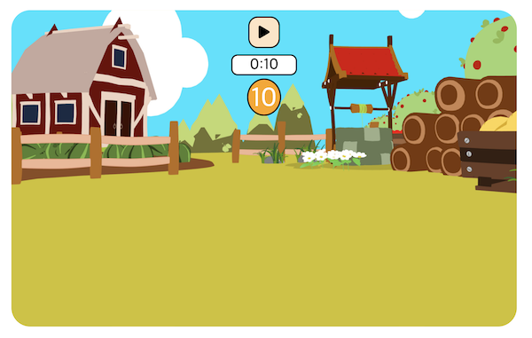
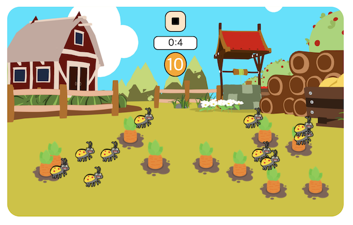
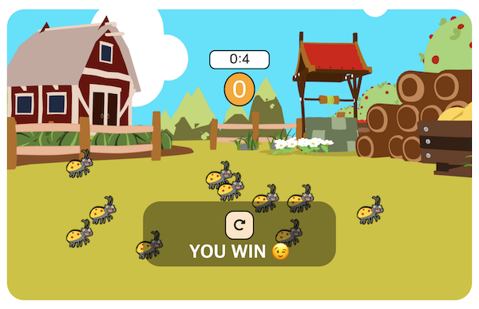
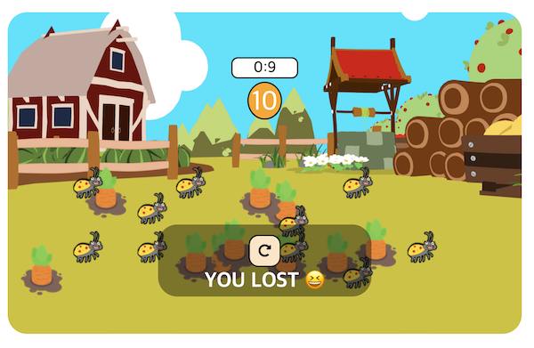
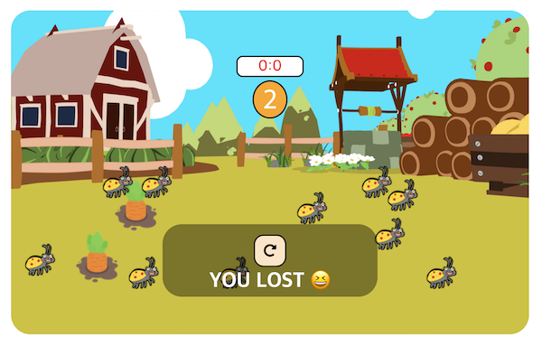
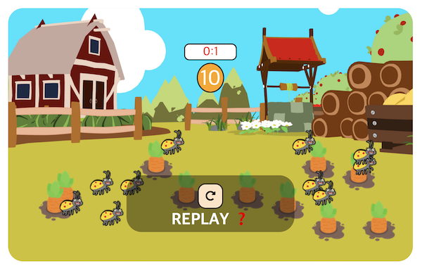

# 당근 뽑기 게임

제한 시간 안에 벌레를 피해서 당근을 모두 뽑으면 WIN! 
제한 시간이 지나거나 벌레를 클릭하면 게임 오버  

  
개요

  <ol>
    <li><a href="#about-the-project">About The Project</a></li>
    <li><a href="#skills">Skills</a></li>
    <li><a href="#screen-shots">Screen Shots</a></li>
    <li><a href="#acknowledgements">Acknowledgements</a></li>
  </ol>

 

---

 

## About The Project

드림 코딩 프론트엔드 필수 브라우저 101 실전 게임 만들기 
솔루션 보기 전 혼자 작성

## Skills

- Vanilla JS
- HTML / CSS

## Screen Shots

- 게임 초기 화면 / 시작 버튼을 누르면 게임 시작 
  
   

- 제한 시간 안에 벌레를 피해서 모든 당근을 뽑으면 WIN 
   

- 벌레를 누르거나 / 시간이 지나거나 / 중지 버튼을 누르면 종료 
  
  
   

## Acknowledgements

- [Font Awesome](https://fontawesome.com/)
- [Dream Coding](https://academy.dream-coding.com/)
